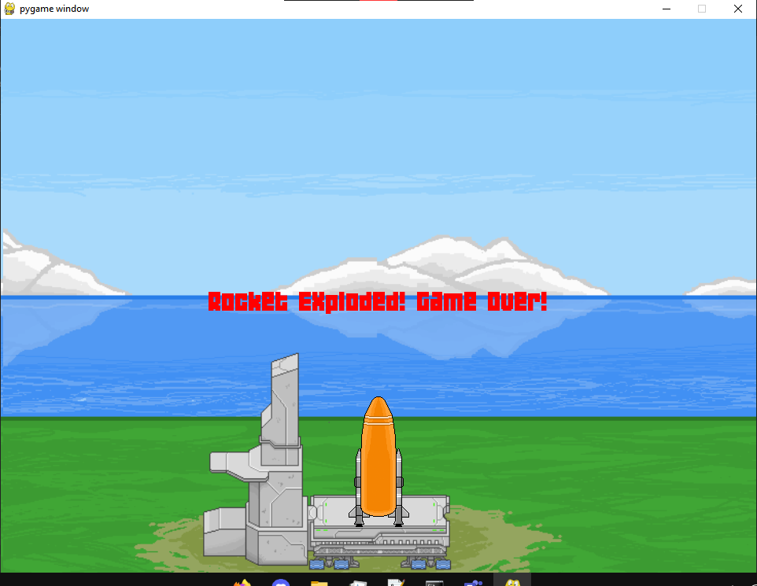

# Space Shuttle Endeavor
### Developed by Papes

# Description:
Space Shuttle Endeavor is a Pygame-based game where players control a space shuttle. This project is part of a final term video project that I worked on. It's still a work in progress, but the physics are functioning well.
> Navigating through space, avoiding obstacles, and collecting points.

## Game Controls:
- Use arrow keys (up, down, left, right) to navigate the space shuttle.
- Press the space bar to detach boosters and tank

## Features:
    - Realistic space shuttle movement simulation.
    - Dynamic obstacle generation for challenging gameplay.
    - Accurate physics
    - Sound effects and background music to enhance immersion.

## Credits:
- Lei01 (@MarkJB01): Sprites, Presentation and Artwork

# Requirements
- Python 3.8.x
- Pygame 2.x
- json
- urllib (if not present in your env)

# Run Instructions
- Run the file launcher.py to start the program.

# Install instructions (Itch.io Release) 
1. Download the game
2. Extract the .rar file
3. Move or open dist and open shuttle.exe
4. Enjoy!

# Screenshots 

